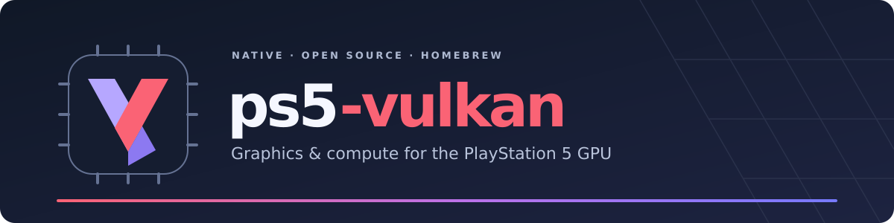

<p align="center">
  
</p>

<p align="center">
  <a href="https://github.com/mpereiraesaa/ps5-vulkan/actions/workflows/host-contracts.yml"></a>
  <a href="LICENSE"></a>
  <a href="API.md"></a>
  <a href="https://github.com/mpereiraesaa/ps5-vulkan/stargazers"></a>
  <a href="https://github.com/mpereiraesaa/ps5-vulkan/pulls"></a>
  <a href="https://github.com/mpereiraesaa/ps5-vulkan/issues"></a>
</p>

<p align="center">
  <a href="BUILDING.md">Build the SDK</a> ·
  <a href="API.md">Supported API</a> ·
  <a href="VALIDATION.md">Hardware validation</a> ·
  <a href="https://github.com/mpereiraesaa/ps5-vulkan/issues">Report an issue</a>
</p>

An experimental, hardware-accelerated Vulkan 1.3 implementation
for native PlayStation 5 homebrew, targeting the console's **gfx1013 GPU**.
It provides a static SDK, runtime SPIR-V compilation and native 1080p
presentation. The instance and device report **Vulkan 1.3**. This is a
**non-conformant experimental implementation**; the supported features,
formats and resource limits are documented in [API.md](API.md).

## What works

- **Graphics:** indexed and indirect draws, multiview, geometry and tessellation,
  clip/cull distances, depth testing, multiple viewports, dynamic topology and
  vertex stride, plus geometry-stage transform feedback and stream queries.
- **Pixels and textures:** independent and dual-source blending, fragment
  storage writes/atomics, 2x/4x colour multisampling with per-sample shading and
  resolve, cube arrays, bounded BC textures, depth sampling and extended gather.
  The ledger records 61 sampled texture formats: 40 filterable rows and
  20 integer rows restricted to nearest filtering.
- **Compute and shaders:** runtime SPIR-V compilation through pinned PSBC/ACO,
  shader/pipeline caches, up to four compute descriptor sets, push and
  specialization constants, 8/16-bit storage access and wave32 compute BASIC.
- **Memory and resources:** a 1.25 GiB graphics heap, a 1 GiB single-buffer
  allocation limit, layout-sized sets of up to 1024 descriptors, and a
  driver-maintained host-coherent buffer memory type. Other resource limits
  remain narrower.
- **Execution:** synchronization2, timeline semaphores, dynamic rendering with
  depth/stencil resolve, imageless framebuffers, descriptor update templates,
  bounded robustness2, and precise occlusion queries.
- **Presentation:** native surface/swapchain acquisition and two-buffer 1080p
  VideoOut presentation, with measured Close Game and relaunch behavior.

Supported formats, stages and resource shapes are deliberately bounded.
See [API.md](API.md) for the exact contracts and [VALIDATION.md](VALIDATION.md)
for artifact-identified native witnesses and deterministic GPU readback.
Host CI alone does not establish hardware correctness.

## Current runtime milestone

The Vulkan 1.3 route exposes promoted feature queries and commands directly,
including synchronization2, dynamic rendering and maintenance4. The pinned
DXVK 2.6.2 D3D11/DXGI workload no longer needs the old version-filter bypass,
feature-level relaxation, or payload-side core/extension translation.
Platform build and WSI adaptations remain separate from DXVK's rendering logic.

The acceptance workload creates a feature-level 11_0 device, renders and reads
back 4096 pixels, and checks clean teardown. Its artifact-bound status is in the
[native result](VALIDATION.md#experimental-vulkan-13-native-dxvk).
An offscreen result is not a presented DXVK frame or general game compatibility.

Read the [runtime backlog](docs/DXVK_V262_BACKLOG.md)
for the remaining work.
There is no Vulkan loader/ICD. Focused [CTS results](UPSTREAM_CTS.md) are
diagnostic evidence, not a full conformance claim or a blanket delivery gate.

## Build and develop

Host checks require Python 3, Make, a C11 compiler and Git:

```sh
make vulkan-headers
make compiler-deps
make check
make check-sanitize
```

Native builds also need the PS5 payload SDK and the companion graphics support
library. Follow [BUILDING.md](BUILDING.md) for dependencies and SDK staging.
Development uses targeted host checks and artifact-identified native witnesses;
the historical requirement matrix is available through `make check-dxvk-ledger`,
not used as a build or promotion gate.

## License

**GPL-3.0-or-later.** See [LICENSE](LICENSE) and [LICENSING.md](LICENSING.md)
for terms, contribution guidance and third-party provenance. Applications
distributed with the static `libps5vk.a` must provide the corresponding source
under GPL-compatible terms. Console system modules and their import facades
are not distributed here.
